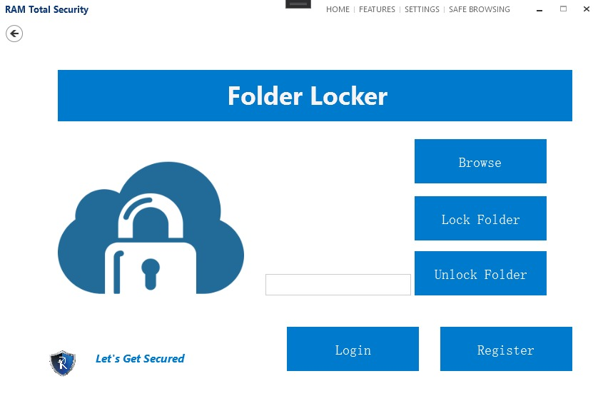

# Folder-Locker
Folder Locker is a simple folder-locking application built using C# and WPF.

## Introduction

Folder Locker is designed to provide a basic folder-locking functionality. Users can lock and unlock folders using a password.
