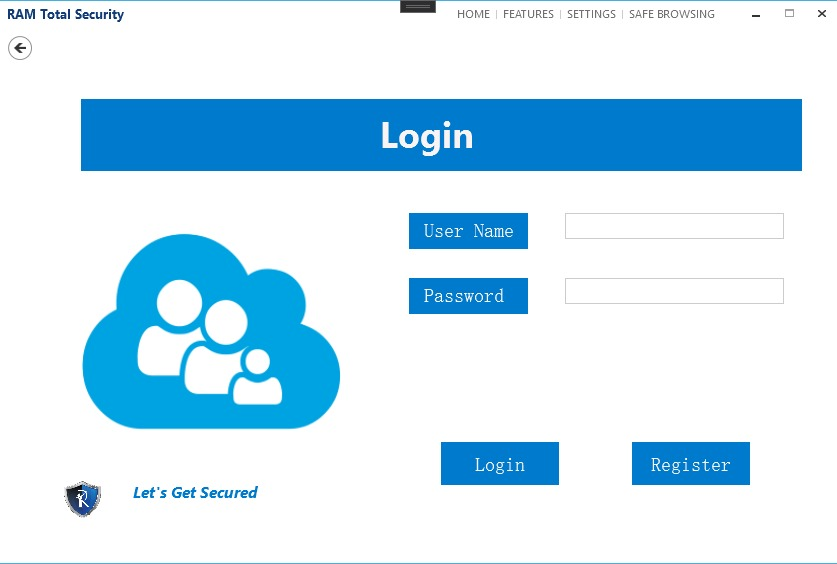

# Folder-Locker
Folder Locker is a simple folder-locking application built using C# and WPF.


## Introduction

Folder Locker is designed to provide a basic folder-locking functionality. Users can lock and unlock folders using a password.
## Features

- Lock and unlock folders.
- Secure password-based folder unlocking.
- Simple and easy-to-use user interface.
  


## Getting Started

To get started with Folder Locker, you need to clone the repository and build the application using Visual Studio or your preferred C# development environment.

### Prerequisites

- Visual Studio or another C# development environment.
- .NET Framework.

### Installation

1. Clone the repository:
   ```shell
   git clone https://github.com/rjghongade/Folder-Locker.git

1. Open the project in Visual Studio.

2. Build and run the application.

### Usage
1. Launch the application.
2. Log in with your credentials.
3. Select a folder to lock.
4. Lock the folder by clicking the "Lock Folder" button.
5. To unlock a folder, use the "Unlock Folder" button and enter the correct password.

### Contributing
Contributions are welcome. Please submit bug reports or feature requests through the GitHub issue tracker.

   

